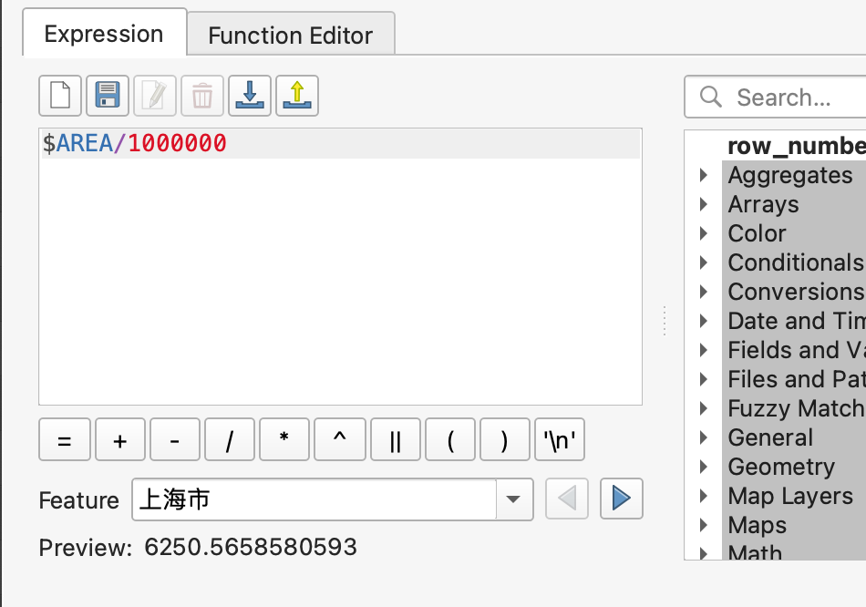

# Intro to QGIS
# Overview  

This workshop will introduce participants to QGIS, a free and open source desktop GIS application, comparable and competitive in many way with Esri's ArcGIS Desktop. We will focus on a very basic introduction to the QGIS interface, and common data carpentry tasks that will come in handy as you prepare and create vector data, in particular, for use in Google Earth Engine.

# Setup

Users should prepare for this workshop by installing the QGIS software appropriate for their operating system and downloading the data to their local hard drive.

## Datasets

Prior to beginning this exercise, download the datasets, using the **Orginal Shapefile** button. Then, Extract the datasets from the downloaded Zip files, into a single directory (mine will be called /data/).

- [Province Boundaries with 2010 Population Census Data: China (100% Short Form data)](https://earthworks.stanford.edu/catalog/stanford-mg792ym3402)
  - [Province Data Dictionary](https://mapninja.github.io/China_Data_Workshop/Prov_variables.html)
- [2010 China Township Census](https://earthworks.stanford.edu/catalog/stanford-rq443fp2092)
  - [Township Data Dictionary](https://mapninja.github.io/China_Data_Workshop/Township_Variables.html)

If you are not a Stanford affiliate, you will not be able to download these datasets, as they are licensed only for use by Stanford Scholars. In that case, the following datasets have been made available ([In the /Data/ folder of this repo](https://github.com/mapninja/China_Data_Workshop/tree/main/data)), or you may download them from the Humanitarian Data Exchange, using the linked text:

* [HOTOSM China South1 Populated Places (OpenStreetMap Export)](https://data.humdata.org/dataset/hotosm_chn_south1_populated_places)
* [China - Subnational Administrative Boundaries](https://github.com/wmgeolab/geoBoundaries/raw/1d9337efa9ead34ce2d1bb7acf867bfbe48f7c4a/releaseData/gbOpen/CHN/ADM1/geoBoundaries-CHN-ADM1-all.zip)

## Software

This workshop was created using QGIS version 3.4, which is the long-term release. If you are in new user we suggest installing the latest long-term release for your operating system. While the latest beta release contains extra features and functionality, it often and also contains bugs and limited functionality, which can be frustrating to new users.

To download QGIS for your operating system go to QGIS.org and click on the download link.

[https://qgis.org/en/site/forusers/download.html](https://qgis.org/en/site/forusers/download.html)
## Interface Intro
# Getting started on a project (10 minutes)

In this section we will cover starting a new QGIS project. We will create a new map document, go over the basic QGIS interface, customize that interface, add a plug-in and bring a base map into your QGIS project.

### Create a Map Document

1. To create a new map document, simply open QGIS and save the resulting empty document to the top level of your project folder, naming your new document something meaningful like `China.qgz` or `Data_Intro.qg`z

*Notice that when you save your map document a new folder in your data browser panel appears. This folder is called Project Home and is a shortcut to the folder containing your map document. It's always a good idea to save your map document to a high-level folder above your data and other project directories.*

# Interface overview

The QGIS interface is similar to many desktop GIS applications. The basic you GIS interface resembles most others GIS interfaces in that it uses a table of contents and data frame model for user interaction. In QGIS the **Table Of Contents** is referred to as the **Layers Panel** and the **Data Frame** is referred to as the **Map Canvas**.

## The Basic Components of the QGIS Interface

The QGIS interface is made up of three basic components:

**The Map Canvas** – the map canvas is where your visualizations of data will show up when you had a new data layer. This is where you will view the changes that are made when you adjust symbology, when you change the order of layers, or when you produce a new data set through geo-processing  

**Tabbed Windows:**

* **The Browser Window** – Functions much as Explorer does in Windows. In this window, you can visualize your drives and folders. Is the equivalent of ArcCatalog in ArcMap.
* **The Layers Window** – This is where your added geographic and non-geographic datasets will show. This is similar to the Table of Contents in ArcMap.
* **Other Panels** - there are many other panels that it is possible to enable in the QGIS interface. We will be making use of the **Processing Toolbox** and **Layer Styling** panel for this workshop.

**General Toolbars:**

* **File Bar** – Has the basic commands of any file: New, Open, Save, Save As. The New Print Composer and Composer Manager are to create and manage layout views.
* **Map Navigation** – Allows the user to Pan, Zoom to a Selected Feature, Zoom In, Zoom Out, Zoom to previous/next extent, and Refresh.
* **Attributes** – These tools allow the user to: Identify attributes, Select / Deselect features, Opens attribute table, measure distance/areas/angles, create spatial bookmarks.
* **Plugins** – QGIS comes with two default plugins: Python Console and QGis 2 Leaflet Webmap.
* **Help** – The question mark booklet is linked to the QGIS User Guide.
* **Manage Layers** – This bar is to add layers (vector, raster, new shapefile layer)

# Customize the interface

When you first open QGIS, you might find the toolbars and panels that are enabled by default are more than your project calls for. Most panels and toolbars in the QGIS interface can be moved around by grabbing the title bar of panels, or the dotted handle on toolbars, and dragging them to the desired location in the interface. You can also use the View menu to turn panels and toobars on and off.

1. Toggle the visibility and move toolbars and panels until your QGIS interface resembles the image below.

# Add a plugin
The first thing we would like to do is add a base map layer to our map project. We will use the **Quick Map Services** plug-in to add a base map created by [Stamen design](https://stamen.com/). QGIS uses a plug-in model to extend the functionality of the basic software. Most plug-ins are contributed by members of the QGIS community and many extend functionality by adding interactivity with external services like geocoding, routing, and base map services.

1. On the **Main menu** of **QGIS**, find the **Plug-ins** menu and open the **Manage and install plugins** dialogue.  
2. In the search box at the top of the dialogue, search for the term "**QuickMapServices**"    
3. The search should return a plug-in called "**QuickMapServices**."
4. Click on the **QuickMapServices** plug-in name and then click the install plug-in button
5. Once the plug-in has successfully installed, Close the plug-in management dialog.

  

# Add a basemap service layer

1. Installing the **QuickMapServices** plug-in should have added a new menu item to the **QGIS Main Menu** called "Web".
2. Click on the Web menu and from the **QuickMapServices** item select "**Settings**."
3. Select the "**More Services**" tab and click on the "**Get contributed pack**" button. This will download a large list of web map services that can be used directly into GIS as base maps.  
  
4. Once the contributed pack has been downloaded click **Save** to close the dialog.
5. Now return to the quick map services menu, and select the **Google>Hybrid** base map.
6. **Save** your **map document**.

## Adding Data (Vector, tabular, raster)

1. Use the Browser Panel to Browse to your Data folder  
2. Right-click on your Data Folder and "Add as a favorite"
3. Expand the Favorites>Data folder and drag the following files into the Layers Panel: `2010ProvA.shp` & `2010TownshipCensus.shp`

## Projections, Tables and Measuring  

### Setting Measurement Properties (Ellipsoid & Units)

QGIS Makes it quite easy to calculate measurements of geographic space (Distance, Direction, Shape, Area) without the added step of 'Projecting' the data. Here you will learn to use the `$AREA` function, which calculates the area of features, using an ellipsoid that accounts for the curvature of the Earth.

1. Toggle off the visibility of the `2010TownshipCensus` Layer
2. Go to Project>Properties and click on the General Tab:

    Note the current Ellipsoid being used, and set it to: `WGS 84(EPSG:7030)` if it isn't already set. Also note the Units for Distance & Area measurement Properties, and adjust them to `Meters` & `Square Meters` if they are not, already, then click OK to close the Properties.

### Measuring Area of features

1. Right-click on the `2010ProvA` Layer and Open the Attribute Table (It may take a few moment to read the attributes into QGIS, this is a large dataset)
2. Click on the Open Field Calculator button   
3. In the Expression Window, put the following calculation:

    `$AREA/1000000`  

    *This calculation uses the `$AREA` function to calculate the area of features, using the Ellipsoid, and converts to Square Meters, by dividing by 1 million. If your data were projected to an area-preserving projection, you could simply use `AREA` to calculate using the Ellipsoid of the data projection*

4. Use the **Create a new field** Option and name the field `SQKM`, then click OK to apply the calculation.
5. Scroll to the far right of the Attribute Table to see the new field, and check it's values.
6. Click on the Toggle Editing Mode button  and Save, when prompted.

## Working with tables

Now that you have a proper Area calculation to work with, we will use it to calculate a population density for each Province. This calculation also makes use of the Field Calculator, though this time we will be using our existing fields to calculate a new one, rather than measuring geometries.

1. Click on the Open Field Calculator button   
2. Use the **Create a new field** Option and name the field `POPDSQKM`with an Output field type of `Decimal number (real)`
3. In the Search box at the center of the Field Calculator, search for:

    `A101004`

    Which is the variable describing **Total Population** count (you can find the data dictionary for this layer in the Github Repo, here: [`2010ProvA` Data Dictionary](./Prov_variables.html))

4. Double-click on the `A1011004` search result, to move it to the **Expression Window**, then click on the division Operator button  (or type / ).
5. Search for the `SQKM` field, and add it after the '/'

6. Click OK to calculate the variable
7. Toggle **Editing Mode** and Save your edits.

## Applying Symbology

1. Go to **View>Panels** and Toggle on the **Layer Styling Panel**.
2. Select `2010ProvA` in the Layers Panel, to make it the active layer in the Layer Styling Panel.
3. Use the following settings:

- **Symbol Type Drop-down**: `Graduated`,  
- **Value Drop-down**: `POPDSQKM` (all the way to the bottom),  
- **Color Ramp Drop-down**:`your choice`,  
- **Mode**: `Natural Breaks (Jenks)`,  
- **Classes**: `6`  

Your changes will apply 'On-the-fly' so that your map should look something like this after these steps:

4. Save your project file to your Data folder,  using the Save Button.

## Overlay analysis
There are many types of overlay analysis, and overlay tools represent some of the most powerful functions in GISci. Here, we will conduct a simple 2 layer Overlay analysis, to combine the `2010ProvA` and `2010TownshipCensus` datasets, by counting the number of Townships, per Province, and providing a summary of the number of households, per Province, calculated from the `2010TownshipCensus` Layer.

1. Go to **Processing>Toolbox** to open the Processing Panel, if not already.
2. Search for 'Join' and double-click on the **Vector>General>Join Attributes by location (summary) tool**
3. Use the following options:

Join to features in: `2010ProvA [EPSG:4326]`  
Where the features: `Intersect`  
By comparing to: `2010TownshipCensus[EPSG:4326]`  

4. Click on the **Fields to summarize** Ellipses Button  and select Field: `A100004` as shown, below, then click OK.

  

5. Click on the Summeries to calculate Ellipses button  and select: `count,min,max,sum,mean,median,stddev`, as shown, below, the click OK.

  

Click on the **Joined Layer** Ellipses button   

6. Save the resulting layer to your Data folder, as `2010ProvTownHHSummary`, with the File Type: `SHP files (*.shp)` and click Save

7. Check your options against the image, below, and click Run.

  

8. Open the attribute table of the resulting `2010ProvTownHHSummary` Layer, and scroll to the far right to confirm the new summary variables have been added.

Note that the Field Names are Prefixed with the name of the Variable they summarize, which in this case makes it a bit difficult to interpret the variables, but they should have been written in the same order that you selected them in: `count,min,max,sum,mean,median,stddev`, which represent:

`count`: _Total_ # of _Townships_ in the Province   
`min`: _Minimum_ # of _Households per Township_ in the Province   
`max`: _Maximum_ # of _Households per Township_ in the Province   
`sum`: _Total_ # of _Households_ in the Province    
`mean`: _Average_ # of _Households per Township_ in the Province   
`median`: _Median_ # of _Households per Township_ in the Province  
`stdev`; _Standard Deviation_ of the #  of _Households per Township_ in the Province

## Export (if time)
QGIS provides many export options. Here we will export to a CSV for use in another software package.

1. Right-click on the new `2010ProvTownHHSummary` Layer and go to **Export>Save Features As...**

2. Note the many options for the Save Format (Below) and select `Comma Separated Values [CSV]`

  

3. Browse to your Data folder and save the Output table as `2010ProvTownHHSummary`

4. There is no need to change the CRS, or any other options. Click OK and your table will be exported, and added to your Project.

## Learn more!
This was just a VERY small sampling of what can be done with QGIS, and other Spatial Data Software packages. If you are interested in learning more, check out the following links:

### Stanford Geospatial Center resources

[The Stanford Geospatial Center](https://library.stanford.edu/research/stanford-geospatial-center)

[Self-serve Spatial Data & Services at Stanford](https://guides.library.stanford.edu/remotesgc)

[https://stanford-geospatial.slack.com](https://stanford-geospatial.slack.com)

### Links to more QGIS Learning materials

[Our Stanford Geospatial Center QGIS 101 Workshop](https://storymaps.arcgis.com/stories/08708488f6464412a00eac19d0f0079a)

[Georeferencing Historic Maps in QGIS ](https://storymaps.arcgis.com/stories/e8d1d13ca8894643970f315d16010ee9)

[QGIS Cartography](https://sites.google.com/stanford.edu/gis-cartography/workshops/qgis-cartography?authuser=0)

[QGIS Tutorials and Tips ](https://www.qgistutorials.com/en/docs/introduction.html)
